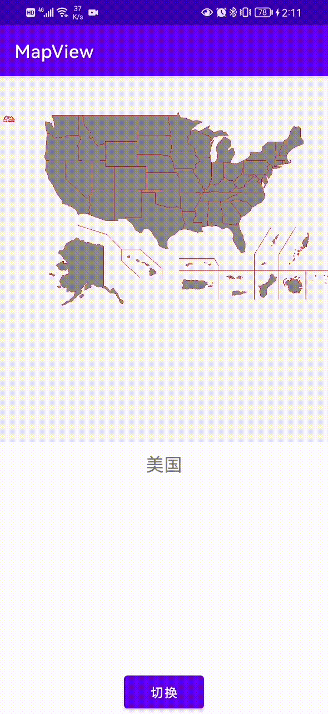

# MapView
可以显示svg地图的控件
# 序言
闲来无事写了个地图控件，基于SVG。可以缩放，可拖动，可点击。SVG具有体积小，不失真的优点。而且由于保存的是路径信息，可以做到复杂图形的点击判断功能。还是很香的。

# 效果

#实现
具体实现可以看我的博客
[可缩放，可拖动，可点击的基于SVG的中国地图控件](https://blog.csdn.net/qq_22706515/article/details/122488911)
